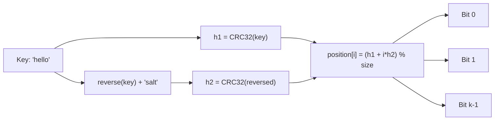
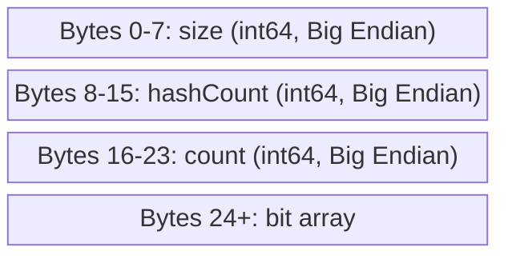

# Bloom Filter

`github.com/entreya/csvquery/internal/common`

The Bloom filter provides **fast negative lookups** with 100% accuracy. When it says a key is NOT present, it's guaranteed to be absent. When it says a key MIGHT be present, there's a small probability of false positive.

## Algorithm: Double Hashing

Uses **two CRC32 hashes** combined for k hash functions:



```go
func (bf *BloomFilter) Add(key string) {
    keyBytes := []byte(key)
    h1 := crc32.ChecksumIEEE(keyBytes)
    
    // Second hash: CRC32 of reversed key + salt
    reversed := appendReversed(buf[:0], keyBytes)
    reversed = append(reversed, "salt"...)
    h2 := crc32.ChecksumIEEE(reversed)
    
    for i := 0; i < bf.hashCount; i++ {
        combined := int(h1) + i*int(h2)
        if combined < 0 {
            combined = -combined
        }
        pos := combined % bf.size
        bf.bits[pos/8] |= (1 << (pos % 8))
    }
    bf.count++
}
```

## Optimal Parameters

Calculated from expected elements (n) and false positive rate (p):

| Formula | Description |
|---------|-------------|
| m = -n × ln(p) / ln(2)² | Optimal bit array size |
| k = (m/n) × ln(2) | Optimal hash count |

```go
func NewBloomFilter(n int, fpRate float64) *BloomFilter {
    // m = -n * ln(p) / (ln(2)^2) ≈ -n * ln(p) / 0.4804
    m := int(-float64(n) * ln(fpRate) / 0.4804)
    m = ((m + 7) / 8) * 8  // Round to bytes
    
    // k = (m/n) * ln(2) ≈ (m/n) * 0.693
    k := int(float64(m) / float64(n) * 0.693)
    if k > 10 { k = 10 }  // Cap for performance
    
    return &BloomFilter{
        bits:      make([]byte, m/8),
        size:      m,
        hashCount: k,
    }
}
```

## Memory Usage

For **1% false positive rate** (default):

| Expected Keys | Bit Array | Total Memory |
|---------------|-----------|--------------|
| 1 million | ~1.2 MB | ~1.2 MB |
| 10 million | ~12.5 MB | ~12.5 MB |
| 100 million | ~125 MB | ~125 MB |
| 1 billion | ~1.25 GB | ~1.25 GB |

> [!TIP]
> Bloom filters use ~10 bits per element for 1% false positive rate, which is **much smaller** than a hash table (~80+ bytes per entry).

## Binary Format

24-byte header followed by the bit array:



```go
func (bf *BloomFilter) Serialize() []byte {
    header := make([]byte, 24)
    binary.BigEndian.PutUint64(header[0:8], uint64(bf.size))
    binary.BigEndian.PutUint64(header[8:16], uint64(bf.hashCount))
    binary.BigEndian.PutUint64(header[16:24], uint64(bf.count))
    return append(header, bf.bits...)
}

func DeserializeBloom(data []byte) *BloomFilter {
    if len(data) < 24 { return nil }
    return &BloomFilter{
        size:      int(binary.BigEndian.Uint64(data[0:8])),
        hashCount: int(binary.BigEndian.Uint64(data[8:16])),
        count:     int(binary.BigEndian.Uint64(data[16:24])),
        bits:      data[24:],
    }
}
```

## Memory-Mapped Loading

For large bloom filters, uses `mmap` for zero-copy access:

```go
func LoadBloomFilterMmap(path string) (*BloomFilter, func(), error) {
    f, err := os.Open(path)
    if err != nil { return nil, nil, err }
    
    data, err := MmapFile(f)
    if err != nil { return nil, nil, err }
    f.Close()  // Can close after mmap
    
    bloom := DeserializeBloom(data)
    cleanup := func() { MunmapFile(data) }
    
    return bloom, cleanup, nil
}
```

## Query Integration

The Query Engine uses bloom filters for **early exit**:

```mermaid
flowchart TB
    Q[Query: column = 'value'] --> Load[Load .bloom file]
    Load --> Check{bloom.MightContain('value')?}
    Check -->|false| Zero[Return 0 results immediately]
    Check -->|true| Index[Proceed to index scan]
    
    style Zero fill:#5a2727
    style Index fill:#2d5a27
```

```go
if hasSearchKey {
    bloomPath := indexPath + ".bloom"
    if bloom, cleanup, err := common.LoadBloomFilterMmap(bloomPath); err == nil {
        defer cleanup()
        if !bloom.MightContain(searchKey) {
            // Key DEFINITELY not in index - early exit
            if countOnly { fmt.Println("0") }
            return nil
        }
    }
}
```

## File Naming

Bloom filter files are stored alongside index files:

| Index File | Bloom File |
|------------|------------|
| `data_column.cidx` | `data_column.cidx.bloom` |
| `data_col1_col2.cidx` | `data_col1_col2.cidx.bloom` |

## Related Documentation

- [CIDX Format](./cidx-format) - Index file format that pairs with bloom filters
- [Query Engine](./query-engine) - Uses bloom filters for early query termination
- [Indexer](./indexer) - Creates bloom filters during index building
