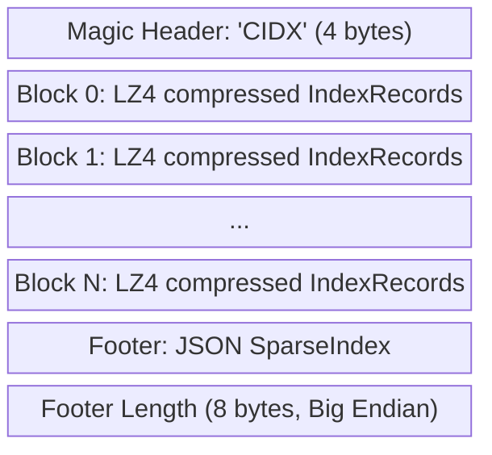
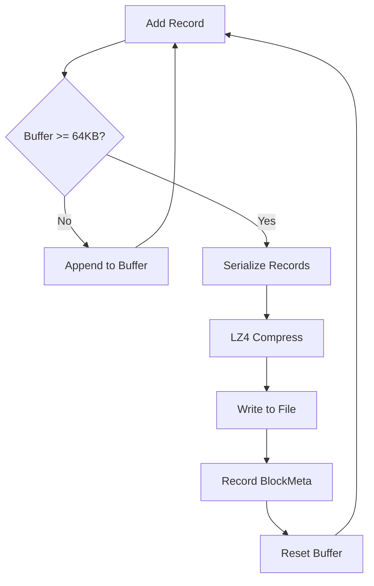
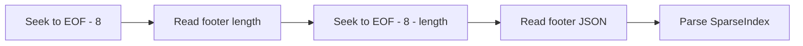
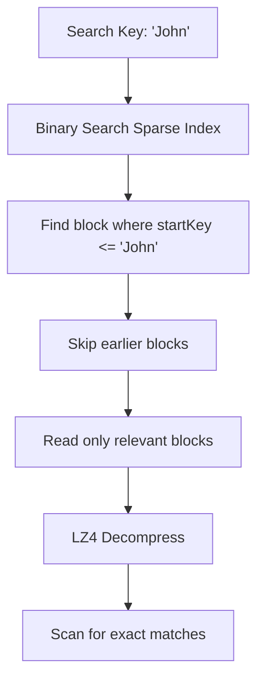

# CIDX Index Format

`github.com/entreya/csvquery/internal/common`

The `.cidx` file format stores compressed, sorted index records with a sparse index footer for efficient binary search.

## File Layout



## Magic Header

Every CIDX file begins with the 4-byte ASCII string `CIDX`:

```go
const MagicCIDX = "CIDX"

func NewBlockWriter(w io.Writer) (*BlockWriter, error) {
    n, err := w.Write([]byte(MagicCIDX))
    // ...
}
```

## Block Structure

### Target Size

Each uncompressed block targets **64 KB** of data:

```go
const BlockTargetSize = 64 * 1024  // 64 KB
```

### LZ4 Compression

Blocks are compressed using LZ4 with 64KB block preference:

```go
lw := lz4.NewWriter(io.Discard)
lw.Apply(lz4.BlockSizeOption(lz4.Block64Kb))
```

### Block Writing Flow



```go
func (bw *BlockWriter) WriteRecord(rec IndexRecord) error {
    bw.buffer = append(bw.buffer, rec)
    bw.currentSize += len(rec.Key) + 16  // Approximate size
    
    if bw.currentSize >= BlockTargetSize {
        return bw.FlushBlock()
    }
    return nil
}
```

## BlockMeta

Metadata for each compressed block:

```go
type BlockMeta struct {
    StartKey    string `json:"startKey"`    // First key in block
    Offset      int64  `json:"offset"`      // Byte offset in file
    Length      int64  `json:"length"`      // Compressed size
    RecordCount int64  `json:"recordCount"` // Records in block
    IsDistinct  bool   `json:"isDistinct"`  // All keys identical?
}
```

### IsDistinct Optimization

If all records in a block have the same key, `IsDistinct = true`. This enables **metadata-only aggregation** for COUNT queries:

```go
// During indexing
isDistinct := true
if len(bw.buffer) > 1 {
    firstKey := bw.buffer[0].Key
    for i := 1; i < len(bw.buffer); i++ {
        if firstKey != bw.buffer[i].Key {
            isDistinct = false
            break
        }
    }
}
```

## Sparse Index (Footer)

The footer contains a JSON array of BlockMeta entries:

```go
type SparseIndex struct {
    Blocks []BlockMeta `json:"blocks"`
}
```

### Example Footer

```json
{
  "blocks": [
    {"startKey": "A", "offset": 4, "length": 2048, "recordCount": 850, "isDistinct": false},
    {"startKey": "M", "offset": 2052, "length": 1920, "recordCount": 800, "isDistinct": false},
    {"startKey": "Z", "offset": 3972, "length": 512, "recordCount": 200, "isDistinct": true}
  ]
}
```

## Reading CIDX Files

### Loading the Footer

The footer is read by seeking from the end:



```go
func NewBlockReader(r io.ReadSeeker) (*BlockReader, error) {
    // Read footer length (last 8 bytes)
    r.Seek(-8, io.SeekEnd)
    var footerLen int64
    binary.Read(r, binary.BigEndian, &footerLen)
    
    // Read footer
    r.Seek(-(8 + footerLen), io.SeekEnd)
    footerBytes := make([]byte, footerLen)
    io.ReadFull(r, footerBytes)
    
    var footer SparseIndex
    json.Unmarshal(footerBytes, &footer)
    
    return &BlockReader{r: r, Footer: footer}, nil
}
```

### Reading a Block

```go
func (br *BlockReader) ReadBlock(meta BlockMeta) ([]IndexRecord, error) {
    // Seek to block
    br.r.Seek(meta.Offset, io.SeekStart)
    
    // Read compressed data
    br.compBuf = br.compBuf[:meta.Length]
    io.ReadFull(br.r, br.compBuf)
    
    // Decompress with LZ4
    lr := lz4.NewReader(bytes.NewReader(br.compBuf))
    
    // Read records
    for {
        rec, err := ReadRecord(lr)
        if err == io.EOF { break }
        br.recBuf = append(br.recBuf, rec)
    }
    return br.recBuf, nil
}
```

## Query Optimization

The sparse index enables efficient key lookup:



## File Naming Convention

| CSV File | Index Column | CIDX File |
|----------|--------------|-----------|
| `data.csv` | `name` | `data_name.cidx` |
| `users.csv` | `email` | `users_email.cidx` |
| `orders.csv` | `customer_id, date` | `orders_customer_id_date.cidx` |

## Related Documentation

- [IndexRecord](./index-record) - Record structure stored in CIDX blocks
- [Bloom Filter](./bloom-filter) - Paired `.bloom` file for fast negative lookups
- [Indexer](./indexer) - Creates CIDX files during indexing
- [Query Engine](./query-engine) - Reads CIDX files during queries
