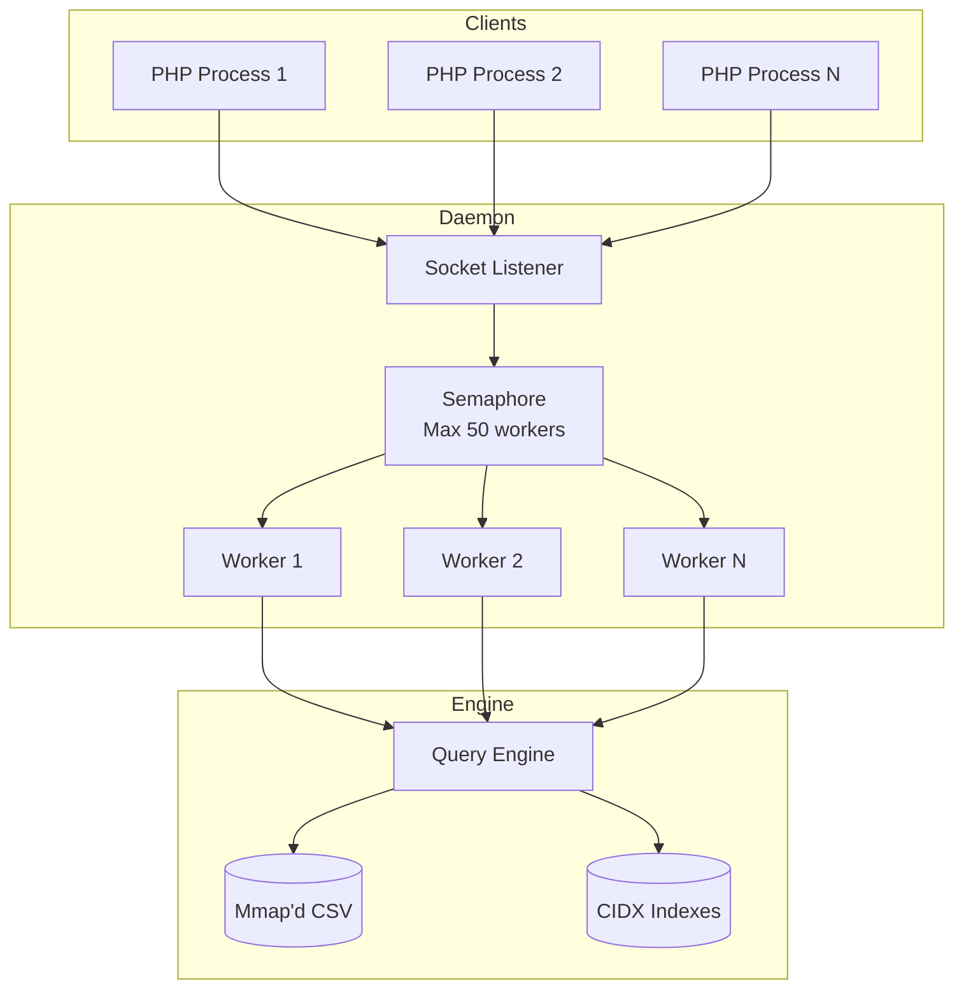
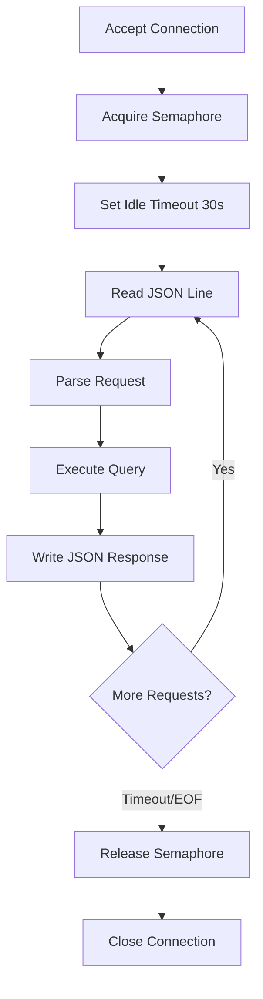

# Daemon

`github.com/entreya/csvquery/internal/server`

The `Daemon` provides a long-running server that listens on a Unix Domain Socket or TCP port. It eliminates the ~50ms startup cost of the Go binary for frequent queries.

## Architecture



## DaemonConfig

```go
type DaemonConfig struct {
    Network        string        // "unix" or "tcp"
    Address        string        // Socket path or "host:port"
    CsvPath        string        // Default CSV file
    IndexDir       string        // Default index directory
    MaxConcurrency int           // Max concurrent workers (default: 50)
    IdleTimeout    time.Duration // Connection idle timeout (default: 30s)
}
```

## Socket Types

| Type | Address Format | Use Case |
|------|----------------|----------|
| Unix | `/tmp/csvquery.sock` | Same-machine, lowest latency |
| TCP | `127.0.0.1:8080` | Cross-machine or container |

```go
// Unix socket (default)
RunDaemon("unix", "/tmp/csvquery.sock", csvPath, indexDir, 50)

// TCP socket
RunDaemon("tcp", "127.0.0.1:8080", csvPath, indexDir, 50)
```

## JSON Protocol

Newline-delimited JSON over the socket connection.

### Request Format

```json
{"action": "count", "csv": "/path/to/data.csv", "where": {"email": "john@example.com"}}
```

### Response Format

```json
{"count": 42, "error": null}
```

## Actions

### ping

Health check:

```json
// Request
{"action": "ping"}

// Response
{"pong": true, "error": null}
```

### count

Count matching rows:

```json
// Request
{"action": "count", "csv": "/data.csv", "where": {"status": "active"}}

// Response
{"count": 1500, "error": null}
```

### select

Get matching row offsets:

```json
// Request
{"action": "select", "csv": "/data.csv", "where": {"email": "john@example.com"}, "limit": 10, "offset": 0}

// Response
{"rows": [{"offset": 12345, "line": 42}, {"offset": 67890, "line": 150}], "error": null}
```

### groupby

Grouped aggregation:

```json
// Request
{"action": "groupby", "csv": "/data.csv", "groupBy": "status", "aggFunc": "count", "where": {}}

// Response
{"groups": {"active": 1500, "inactive": 300, "pending": 50}, "error": null}
```

### query

Generic query with optional explain:

```json
// Request
{"action": "query", "csv": "/data.csv", "where": {"id": "123"}, "explain": true}

// Response
{"data": {"index": "id", "type": "IndexScan", "blocks_scanned": 1}, "error": null}
```

### status

Daemon status information:

```json
// Request
{"action": "status"}

// Response
{
  "status": "running",
  "csv": "/data/users.csv",
  "indexDir": "/data/indexes",
  "rows": 10000000,
  "columns": 15,
  "network": "unix",
  "address": "/tmp/csvquery.sock",
  "error": null
}
```

## Connection Handling



## Concurrency Control

Uses a **counting semaphore** to limit concurrent workers:

```go
type UDSDaemon struct {
    sem chan struct{}  // Buffered channel as semaphore
    // ...
}

func (d *UDSDaemon) handleConnection(conn net.Conn) {
    // Acquire worker slot
    select {
    case d.sem <- struct{}{}:
        defer func() { <-d.sem }()  // Release on exit
    case <-d.shutdown:
        return
    }
    
    // Process requests...
}
```

## Graceful Shutdown

Signal handling for clean shutdown:

```go
sigChan := make(chan os.Signal, 1)
signal.Notify(sigChan, syscall.SIGTERM, syscall.SIGINT)

go func() {
    <-sigChan
    d.Shutdown()  // Closes listener, waits for workers
}()
```

## Starting the Daemon

### CLI

```bash
csvquery daemon --socket /tmp/csvquery.sock --csv data.csv --index-dir ./indexes
```

### PHP (Auto-start)

The PHP `SocketClient` automatically starts the daemon if not running:

```php
$client = SocketClient::getInstance($binaryPath, $indexDir);
// Daemon starts automatically on first query
```

## Related Documentation

- [Query Engine](./query-engine) - Executes queries dispatched by daemon
- [SocketClient (PHP)](../php/socketclient) - PHP client for daemon connections
- [CLI Commands](./cli) - Command-line interface for daemon
