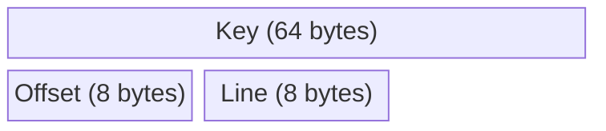

# IndexRecord

`github.com/entreya/csvquery/internal/common`

The `IndexRecord` is the fundamental data unit stored in CIDX index files. Each record is exactly **80 bytes**, enabling zero-allocation reads and predictable memory layout.

## Record Structure



```go
const RecordSize = 64 + 8 + 8  // 80 bytes

type IndexRecord struct {
    Key    [64]byte // Fixed 64-byte key (no pointer, no heap alloc)
    Offset int64    // Byte offset in CSV file
    Line   int64    // Line number (1-based)
}
```

## Field Details

### Key (64 bytes)

- **Fixed size**: Always 64 bytes, null-padded if shorter
- **No heap allocation**: Uses fixed array, not slice
- **Composite keys**: Stored as JSON array: `["value1","value2"]`

```go
// Single column key
var key [64]byte
copy(key[:], "hello")  // Null-padded to 64 bytes

// Composite key (multiple columns)
compositeKey := `["John","Doe"]`
copy(key[:], compositeKey)
```

### Offset (8 bytes)

- **Big Endian** int64
- **Byte position** in the CSV file where this row starts
- Used for **random access** to fetch full row data

### Line (8 bytes)

- **Big Endian** int64
- **1-based** line number in the CSV file
- Currently stored but not always populated (often 0)

## Binary Encoding

All numeric fields use **Big Endian** byte order:

```go
func WriteRecord(w io.Writer, rec IndexRecord) error {
    var buf [RecordSize]byte
    
    // Copy Key (64 bytes)
    copy(buf[0:64], rec.Key[:])
    
    // Write Offset (8 bytes, Big Endian)
    binary.BigEndian.PutUint64(buf[64:72], uint64(rec.Offset))
    
    // Write Line (8 bytes, Big Endian)
    binary.BigEndian.PutUint64(buf[72:80], uint64(rec.Line))
    
    _, err := w.Write(buf[:])
    return err
}
```

## Reading Records

### Single Record

```go
func ReadRecord(reader io.Reader) (IndexRecord, error) {
    var buf [RecordSize]byte
    if _, err := io.ReadFull(reader, buf[:]); err != nil {
        return IndexRecord{}, err
    }
    
    return IndexRecord{
        Key:    *(*[64]byte)(buf[0:64]),
        Offset: int64(binary.BigEndian.Uint64(buf[64:72])),
        Line:   int64(binary.BigEndian.Uint64(buf[72:80])),
    }, nil
}
```

### Batch Reading (Optimized)

For performance, read multiple records in a single I/O call:

```go
func ReadBatchRecords(r io.Reader, count int) ([]IndexRecord, error) {
    totalBytes := count * RecordSize
    buf := make([]byte, totalBytes)
    if _, err := io.ReadFull(r, buf); err != nil {
        return nil, err
    }
    
    recs := make([]IndexRecord, count)
    for i := 0; i < count; i++ {
        offset := i * RecordSize
        recs[i] = IndexRecord{
            Key:    *(*[64]byte)(buf[offset : offset+64]),
            Offset: int64(binary.BigEndian.Uint64(buf[offset+64 : offset+72])),
            Line:   int64(binary.BigEndian.Uint64(buf[offset+72 : offset+80])),
        }
    }
    return recs, nil
}
```

## Key Comparison

Zero-allocation comparison against search keys:

```go
func compareRecordKey(key *[64]byte, searchKey []byte) int {
    // Find effective length (skip trailing nulls)
    keyLen := 64
    for keyLen > 0 && key[keyLen-1] == 0 {
        keyLen--
    }
    return bytes.Compare(key[:keyLen], searchKey)
}
```

## Memory Layout

The fixed-size structure enables efficient memory usage:

| Field | Offset | Size | Alignment |
|-------|--------|------|-----------|
| Key | 0 | 64 | 1 |
| Offset | 64 | 8 | 8 |
| Line | 72 | 8 | 8 |
| **Total** | - | **80** | - |

> [!NOTE]
> The 64-byte key size is a design tradeoff:
> - **Pros**: Fixed size enables zero-allocation, predictable memory
> - **Cons**: Keys longer than 64 bytes are truncated
> - **Mitigation**: Most database keys (IDs, emails, names) are well under 64 bytes

## Usage in Indexer

During indexing, records are created for each row:

```go
for i, key := range keys {
    var keyBytes [64]byte
    copy(keyBytes[:], key)
    
    rec := common.IndexRecord{
        Key:    keyBytes,
        Offset: offset,
        Line:   line,
    }
    
    // Send to channel for sorting
    channels[i] <- rec
}
```

## Related Documentation

- [CIDX Format](./cidx-format) - Container format that stores IndexRecords
- [Indexer](./indexer) - Creates IndexRecords during scanning
- [Query Engine](./query-engine) - Reads and compares IndexRecords
