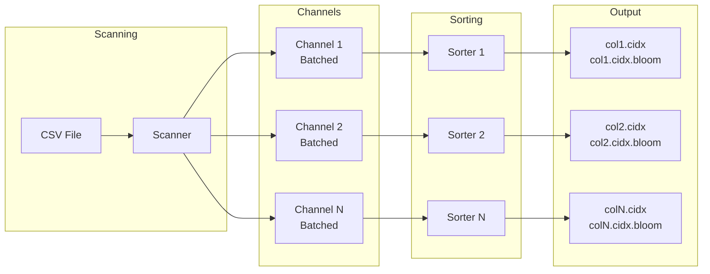
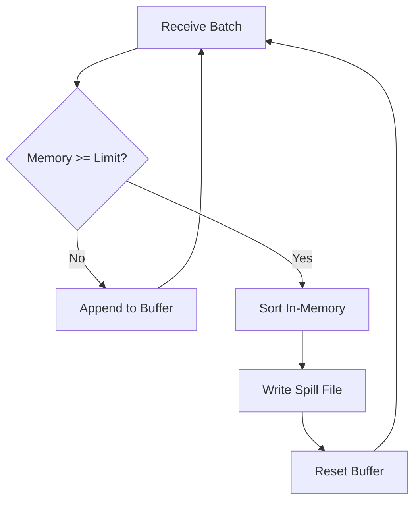

# Indexer

`github.com/entreya/csvquery/internal/indexer`

The `Indexer` builds compressed indexes from CSV files using a **pipelined architecture** with parallel workers and external merge sort. It processes files at GB/s speeds while respecting memory limits.

## Architecture Overview



## IndexerConfig

```go
type IndexerConfig struct {
    InputFile   string  // Path to CSV file
    OutputDir   string  // Output directory for indexes
    Columns     string  // JSON array of column definitions
    Separator   string  // CSV separator (default: ",")
    Workers     int     // Parallel workers (default: NumCPU)
    MemoryMB    int     // Memory limit per worker (default: 500MB)
    BloomFPRate float64 // Bloom filter false positive rate (default: 0.01)
    Verbose     bool    // Enable real-time progress
    Version     string  // Version string for header display
}
```

## Pipelined Processing

### Phase 1: Scanning

The Scanner reads CSV data and sends extracted keys to Sorters via buffered channels:

```go
// Batching minimizes channel overhead
const batchSize = 1000

workerBuffers := make([][][]common.IndexRecord, numWorkers)
for w := 0; w < numWorkers; w++ {
    workerBuffers[w] = make([][]common.IndexRecord, numIndexes)
}

scanner.Scan(colIndices, func(workerID int, keys [][]byte, offset, line int64) {
    for i, key := range keys {
        var keyBytes [64]byte
        copy(keyBytes[:], key)
        
        rec := common.IndexRecord{Key: keyBytes, Offset: offset, Line: line}
        workerBuffers[workerID][i] = append(workerBuffers[workerID][i], rec)
        
        // Flush when batch is full
        if len(workerBuffers[workerID][i]) >= batchSize {
            channels[i] <- workerBuffers[workerID][i]
            workerBuffers[workerID][i] = make([]common.IndexRecord, 0, batchSize)
        }
    }
})
```

### Phase 2: Sorting & Spilling

Each Sorter buffers records in memory and spills to disk when full:



### Phase 3: K-Way Merge

Final merge produces sorted, LZ4-compressed CIDX files:

```go
func (s *Sorter) Finalize() (int64, error) {
    // Sort any remaining in-memory data
    s.sortBuffer()
    
    // K-way merge all spill files
    return s.kWayMerge()
}
```

## Column Definitions

Supports single columns and composite indexes:

```json
// Single columns
["email", "username"]

// Composite indexes (for multi-column queries)
[["customer_id", "date"], "email"]
```

## CSV DNA (Integrity Protection)

Indexes are validated against the source CSV using a **fingerprint**:

```go
func (indexer *Indexer) calculateFingerprint() csvDNA {
    // Sample 512KB from three positions
    sampleSize := 512 * 1024
    
    hasher := sha1.New()
    
    // 1. Start (first 512KB)
    file.ReadAt(buf, 0)
    hasher.Write(buf)
    
    // 2. Middle
    file.ReadAt(buf, size/2 - sampleSize/2)
    hasher.Write(buf)
    
    // 3. End (last 512KB)
    file.ReadAt(buf, size - sampleSize)
    hasher.Write(buf)
    
    return csvDNA{
        size:  stat.Size(),
        mtime: stat.ModTime().Unix(),
        hash:  hex.EncodeToString(hasher.Sum(nil)),
    }
}
```

## Output Files

| File | Description |
|------|-------------|
| `{csv}_{column}.cidx` | LZ4-compressed sorted index |
| `{csv}_{column}.cidx.bloom` | Bloom filter for fast lookups |
| `{csv}_meta.json` | Index metadata (row count, file stats) |

### Metadata Example

```json
{
  "capturedAt": "2026-02-07T12:00:00Z",
  "totalRows": 10000000,
  "csvSize": 1073741824,
  "csvMtime": 1738922400,
  "csvHash": "a1b2c3d4e5f6...",
  "indexes": {
    "email": {"distinctCount": 9500000, "fileSize": 524288000},
    "customer_id_date": {"distinctCount": 8000000, "fileSize": 480000000}
  }
}
```

## Methods

### NewIndexer

```go
func NewIndexer(config IndexerConfig) *Indexer
```

Creates a new indexer with the specified configuration.

### Run

```go
func (indexer *Indexer) Run() error
```

Executes the full indexing pipeline:
1. Creates Scanner with mmap
2. Spawns Sorter goroutines (one per index)
3. Scans CSV, batches records, sends to channels
4. Sorters perform external merge sort
5. Writes CIDX + Bloom files
6. Saves metadata JSON

### Cleanup

```go
func (indexer *Indexer) Cleanup()
```

Removes temporary spill files and directories.

## Real-Time Progress

With `Verbose: true`, displays live statistics:

```
[Scanning] Rows: 5000000 | Rate: 450000/s | Elapsed: 11s | ETA: 11s
```

## Related Documentation

- [Scanner](./scanner) - SIMD-accelerated CSV parsing
- [CIDX Format](./cidx-format) - Output file format
- [Bloom Filter](./bloom-filter) - Fast negative lookup filter
- [Index Record](./index-record) - Record structure in indexes
