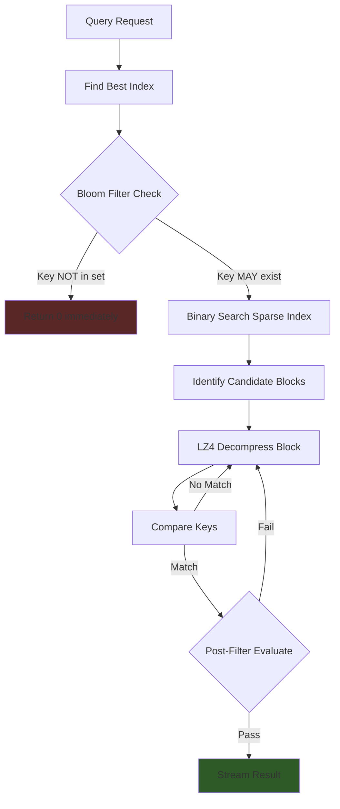
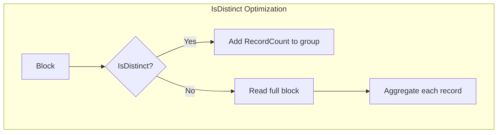

# Query Engine

`github.com/entreya/csvquery/internal/query`

The `QueryEngine` plans and executes queries using a **multi-phase approach**: Bloom filter pruning, binary search on sparse indexes, block decompression, and post-filtering.

## Query Execution Flow



## QueryConfig

```go
type QueryConfig struct {
    CsvPath      string     // Path to CSV file
    IndexDir     string     // Directory containing .cidx files
    Where        *Condition // Root of the filter tree
    Limit        int        // Max results (0 = no limit)
    Offset       int        // Skip first N results
    CountOnly    bool       // Only return count
    Explain      bool       // Return execution plan JSON
    GroupBy      string     // Column to group by
    AggCol       string     // Column to aggregate
    AggFunc      string     // Aggregation: count, sum, avg, min, max
    Verbose      bool       // Debug output to stderr
    DebugHeaders bool       // Debug raw header detection
}
```

## Index Selection Strategy

The engine selects the best available index:

```go
func (q *QueryEngine) findBestIndex() (indexPath, searchKey string, hasKey bool, plan map[string]interface{}, err error) {
    // 1. Try exact composite match (e.g., customer_id + date)
    // 2. Fall back to single-column index
    // 3. Fall back to full scan if no index
}
```

### Index Priority

1. **Composite index** matching all WHERE columns
2. **Single-column index** matching the most selective column
3. **Full scan** when no usable index exists

## Bloom Filter Pruning

Early exit when key definitely doesn't exist:

```go
if hasSearchKey {
    bloomPath := indexPath + ".bloom"
    bloom, cleanup, err := common.LoadBloomFilterMmap(bloomPath)
    if err == nil {
        defer cleanup()
        if !bloom.MightContain(searchKey) {
            // Key DEFINITELY not in index
            if q.config.CountOnly { fmt.Println("0") }
            return nil
        }
    }
}
```

## Binary Search on Sparse Index

Finds the first block that may contain the key:

```go
func (q *QueryEngine) findStartBlock(sparse common.SparseIndex, key string) int {
    left, right := 0, len(sparse.Blocks)-1
    result := -1
    
    for left <= right {
        mid := (left + right) / 2
        if sparse.Blocks[mid].StartKey <= key {
            result = mid
            left = mid + 1
        } else {
            right = mid - 1
        }
    }
    return result
}
```

## Block Scanning

### Standard Output (Offset Stream)

```go
for i := startBlockIdx; i <= endBlockIdx; i++ {
    blockMeta := br.Footer.Blocks[i]
    
    // Early exit if past our search key
    if hasSearchKey && blockMeta.StartKey > searchKey {
        break
    }
    
    records, err := br.ReadBlock(blockMeta)  // LZ4 decompress
    
    for _, rec := range records {
        cmp := compareRecordKey(&rec.Key, searchKeyBytes)
        if cmp < 0 { continue }  // Key too small
        if cmp > 0 { break }     // Key too large, done
        
        // Optional post-filter
        if q.config.Where != nil {
            row := readCsvRow(csvData, rec.Offset)
            if !q.config.Where.Evaluate(row) { continue }
        }
        
        fmt.Fprintf(writer, "%d,%d\n", rec.Offset, rec.Line)
    }
}
```

### Aggregation (Group By)



```go
// Ultra-fast count for distinct blocks
if isGroupingByIndex && blockMeta.IsDistinct && canUseMetadata {
    groupKey := blockMeta.StartKey
    results[groupKey] += float64(blockMeta.RecordCount)
    continue  // Skip ReadBlock entirely!
}
```

## COUNT(*) Optimization

For counts without filters, uses index metadata:

```go
func (q *QueryEngine) tryCountFromIndex() (int64, bool) {
    br, err := common.NewBlockReader(indexFile)
    if err != nil { return 0, false }
    
    var total int64
    for _, block := range br.Footer.Blocks {
        total += block.RecordCount
    }
    return total, true
}
```

## Post-Filter Evaluation

When WHERE conditions aren't fully covered by the index:

```go
// Extract columns from CSV row
row := extractCols(csvData[rec.Offset:], ',', maxCol)

// Inject virtual columns from schema
row = append(row, virtualDefaults...)

// Build column map for evaluation
for col, idx := range headers {
    rowMap[col] = row[idx]
}

// Evaluate condition tree
if !q.config.Where.Evaluate(rowMap) {
    continue  // Skip this row
}
```

## Explain Output

With `Explain: true`, returns execution plan:

```json
{
  "index": "email",
  "type": "IndexScan",
  "covered_columns": ["email"],
  "searchKey": "john@example.com",
  "blocks_scanned": 5,
  "estimated_rows": 850
}
```

## Methods

### NewQueryEngine

```go
func NewQueryEngine(config QueryConfig) *QueryEngine
```

Creates a new query engine and loads any updates from `_updates.json`.

### Run

```go
func (q *QueryEngine) Run() error
```

Executes the query:
1. Validates configuration
2. Plans index strategy
3. Checks bloom filter
4. Scans candidate blocks
5. Applies post-filter
6. Streams or aggregates results

## Related Documentation

- [CIDX Format](./cidx-format) - Index file format read by query engine
- [Bloom Filter](./bloom-filter) - Fast negative lookup
- [Index Record](./index-record) - Record structure in blocks
- [Daemon](./daemon) - Wraps query engine for socket access
