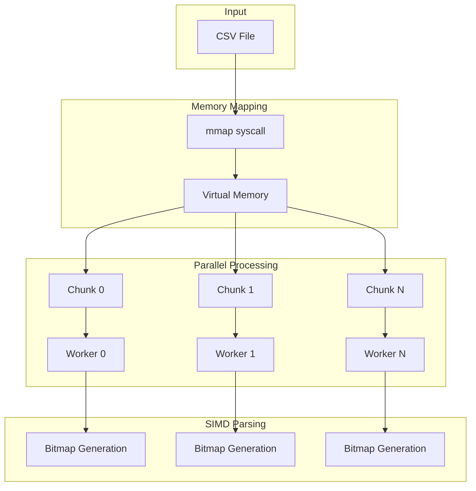
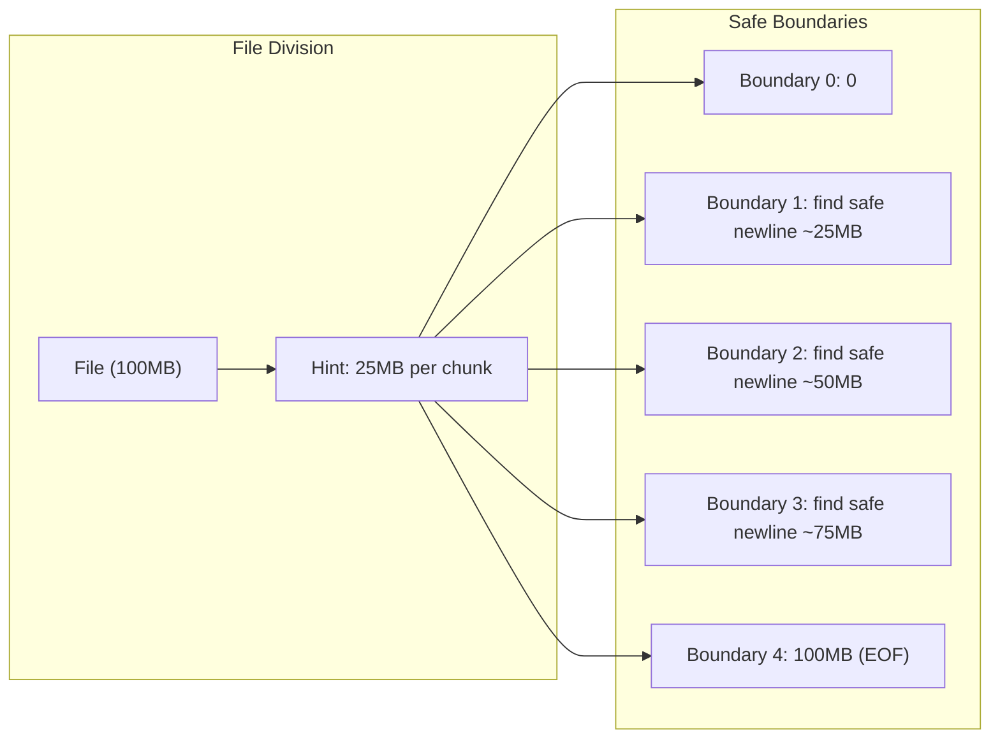
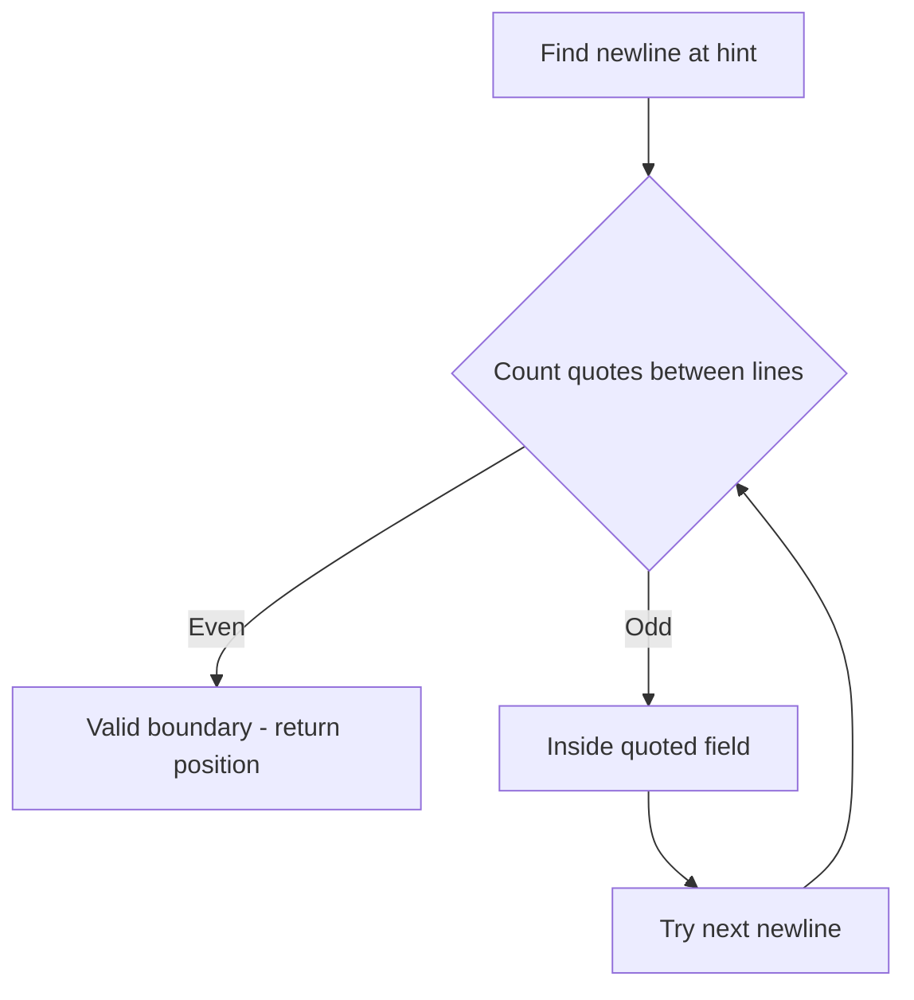

# Scanner

`github.com/entreya/csvquery/internal/indexer`

The `Scanner` provides high-performance CSV parsing using memory mapping (mmap) and SIMD instructions. It achieves **multi-GB/s throughput** by avoiding data copies and saturating all CPU cores.

## Architecture Overview



## Memory Mapping

Uses `mmap` syscall for **zero-copy file access**:

```go
func NewScanner(filePath, separator string) (*Scanner, error) {
    file, err := os.Open(filePath)
    // ...
    
    // Memory-map the entire file
    data, err := common.MmapFile(file)
    if err != nil { return nil, err }
    
    scanner := &Scanner{
        data:      data,  // Direct pointer to file contents
        fileSize:  size,
        workers:   runtime.NumCPU(),
        separator: separator[0],
    }
    
    // Parse headers
    scanner.readHeaders()
    return scanner, nil
}
```

> [!TIP]
> Memory mapping avoids loading the entire file into RAM. The OS pages in data on demand, enabling processing of files larger than available memory.

## Parallel Chunking Strategy

The file is divided among workers with **gap-free boundaries**:



```go
func (scanner *Scanner) Scan(...) error {
    dataSize := len(scanner.data)
    chunkSize := (dataSize - startIdx) / scanner.workers
    
    // Precompute ALL safe boundaries to prevent gaps/overlaps
    boundaries := make([]int, scanner.workers+1)
    boundaries[0] = startIdx  // After header
    boundaries[scanner.workers] = dataSize  // EOF
    
    for i := 1; i < scanner.workers; i++ {
        hint := startIdx + (i * chunkSize)
        boundaries[i] = findSafeRecordBoundary(scanner.data, hint)
    }
    
    // Launch workers with guaranteed gap-free chunks
    for i := 0; i < scanner.workers; i++ {
        start := boundaries[i]
        end := boundaries[i+1]
        go scanner.processChunk(start, end, i, ...)
    }
}
```

## Safe Record Boundary Detection

Handles **quoted fields containing newlines**:

```go
func findSafeRecordBoundary(data []byte, hint int) int {
    currentNL := hint
    
    for {
        // Find next newline
        nextNL := bytes.IndexByte(data[currentNL+1:], '\n')
        if nextNL == -1 { return len(data) }
        nextPos := currentNL + 1 + nextNL
        
        // Count quotes between currentNL and nextNL
        quotes := 0
        for i := currentNL + 1; i < nextPos; i++ {
            if data[i] == '"' { quotes++ }
        }
        
        // Even quotes = self-contained line = valid boundary
        if quotes % 2 == 0 {
            return currentNL + 1
        }
        
        // Odd quotes = inside multiline field, try next line
        currentNL = nextPos
    }
}
```



## SIMD Bitmap Parsing

Generates bitmaps for **word-at-a-time processing**:

```go
func (scanner *Scanner) processChunk(...) {
    // Generate bitmaps for entire chunk
    bitmapLen := (chunkLen + 63) / 64
    quotesBitmap := make([]uint64, bitmapLen)
    sepsBitmap := make([]uint64, bitmapLen)
    newlinesBitmap := make([]uint64, bitmapLen)
    
    simd.ScanWithSeparator(dataChunk, sep, quotesBitmap, sepsBitmap, newlinesBitmap)
    
    // Process 64 bytes at a time using bitmaps
    inQuote := false
    for wordIdx := 0; wordIdx < bitmapLen; wordIdx++ {
        quoteMask := quotesBitmap[wordIdx]
        newlineMask := newlinesBitmap[wordIdx]
        
        // Fast path: skip if no structural characters
        if quoteMask == 0 && newlineMask == 0 && !inQuote {
            continue
        }
        
        // Process set bits using TrailingZeros
        combined := quoteMask | newlineMask
        for combined != 0 {
            tz := bits.TrailingZeros64(combined)
            bytePos := wordIdx*64 + tz
            // Handle quote or newline at bytePos...
        }
    }
}
```

## Header Parsing

Parses the first line with BOM detection:

```go
func (scanner *Scanner) readHeaders() error {
    idx := bytes.IndexByte(scanner.data, '\n')
    line := scanner.data[:idx]
    
    // Handle UTF-8 BOM
    if len(line) >= 3 && line[0] == 0xEF && line[1] == 0xBB && line[2] == 0xBF {
        line = line[3:]
    }
    
    // Handle UTF-16 BOM (not supported)
    if line[0] == 0xFF || line[0] == 0xFE {
        return fmt.Errorf("UTF-16 encoding not supported")
    }
    
    // Parse headers (case-insensitive map)
    parts := bytes.Split(line, []byte{scanner.separator})
    for i, part := range parts {
        name := strings.ToLower(string(bytes.TrimSpace(part)))
        scanner.headerMap[name] = i
    }
}
```

## Methods

### NewScanner

```go
func NewScanner(filePath, separator string) (*Scanner, error)
```

Creates a new scanner instance with mmap'd file.

### Scan

```go
func (scanner *Scanner) Scan(indexDefs [][]int, handler func(workerID int, keys [][]byte, offset, line int64)) error
```

Iterates over the CSV file in parallel:
- **indexDefs**: Column indices to extract for each index
- **handler**: Thread-safe callback for each row

### GetStats

```go
func (scanner *Scanner) GetStats() (rowsScanned int64, bytesRead int64, elapsed time.Duration)
```

Returns real-time scanning statistics (atomic counters).

### SetWorkers

```go
func (scanner *Scanner) SetWorkers(n int)
```

Overrides the default worker count (defaults to `runtime.NumCPU()`).

### Close

```go
func (scanner *Scanner) Close() error
```

Unmaps the file from memory.

## Performance Characteristics

| File Size | Workers | Throughput | Notes |
|-----------|---------|------------|-------|
| 1 GB | 8 | ~2 GB/s | SSD limited |
| 10 GB | 16 | ~3 GB/s | Memory bandwidth limited |
| 100 GB | 16 | ~2.5 GB/s | Sustained throughput |

## Related Documentation

- [SIMD](./simd) - Hardware-accelerated delimiter detection
- [Indexer](./indexer) - Uses Scanner for parallel indexing
- [Index Record](./index-record) - Output format from Scanner
