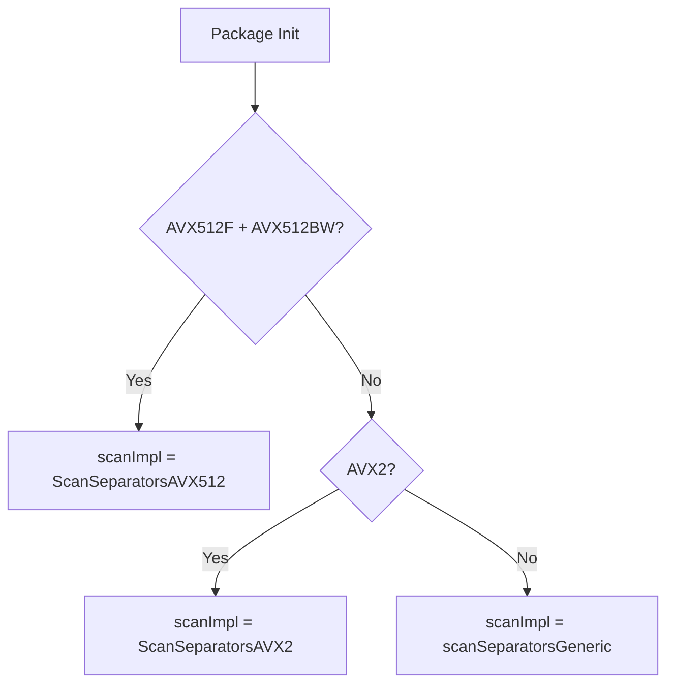
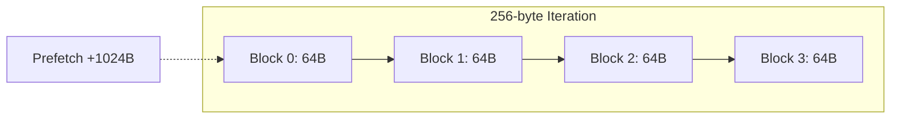
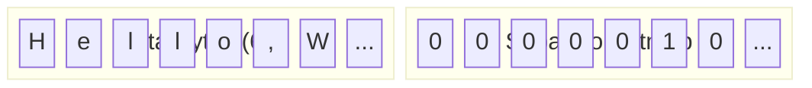

# SIMD Acceleration

`github.com/entreya/csvquery/internal/simd`

The SIMD module provides hardware-accelerated byte scanning for CSV parsing. It detects delimiters (separators, quotes, newlines) at speeds exceeding 10 GB/s on modern CPUs.

## CPU Detection

At package initialization, the runtime selects the optimal implementation based on CPU capabilities:



```go
func init() {
    if cpu.X86.HasAVX512F && cpu.X86.HasAVX512BW {
        scanImpl = ScanSeparatorsAVX512
    } else if cpu.X86.HasAVX2 {
        scanImpl = ScanSeparatorsAVX2
    } else {
        scanImpl = scanSeparatorsGeneric
    }
}
```

## AVX2 Implementation

Processes **32 bytes per iteration** using 256-bit YMM registers.

### Assembly Walkthrough

```asm
// func ScanSeparatorsAVX2(data []byte, sep byte) uint64
TEXT ·ScanSeparatorsAVX2(SB), NOSPLIT, $8-40
    MOVQ    data_base+0(FP), SI    // SI = data pointer
    MOVQ    data_len+8(FP), CX     // CX = data length
    MOVB    sep+24(FP), AL         // AL = separator byte
    XORQ    R8, R8                 // R8 = count accumulator

    // Broadcast separator to all 32 bytes of Y0
    VPBROADCASTB tmp-1(SP), Y0

loop_avx2:
    VMOVDQU (SI), Y1           // Load 32 bytes unaligned
    VPCMPEQB Y0, Y1, Y1        // Compare each byte to separator
    VPMOVMSKB Y1, R9           // Extract 32-bit mask of matches
    POPCNTL R9, R9             // Count set bits (matches)
    ADDQ    R9, R8             // Accumulate count

    ADDQ    $32, SI            // Advance pointer
    SUBQ    $32, CX            // Decrement length
    JMP     loop_avx2
```

**Key Instructions:**
| Instruction | Operation | Latency |
|-------------|-----------|---------|
| `VPBROADCASTB` | Fill 32 bytes with separator | 1 cycle |
| `VPCMPEQB` | Compare 32 bytes simultaneously | 1 cycle |
| `VPMOVMSKB` | Extract comparison mask to scalar | 3 cycles |
| `POPCNTL` | Population count (bit counting) | 3 cycles |

## AVX512 Implementation

Processes **64 bytes per iteration** with **4x unrolled loop** (256 bytes per iteration).

### Unrolled Loop Architecture



```asm
unrolled_loop_start:
    CMPQ    CX, $256
    JB      single_block_loop

    PREFETCHT0 1024(SI)         // Prefetch ahead for memory bandwidth

    // Block 1 (bytes 0-63)
    VMOVDQU64 (SI), Z1          // Load 64 bytes
    VPCMPB    $0, Z0, Z1, K1    // Compare to separator → mask K1
    KMOVQ     K1, R9            // Move 64-bit mask to register
    POPCNTQ   R9, R9            // Count matches
    ADDQ      R9, R8

    // Block 2-4 follow same pattern at offsets 64, 128, 192...
```

### Masked Tail Handling

For data sizes not divisible by 64, AVX512 uses **masked operations**:

```asm
tail_avx512:
    // Create mask: K7 = (1 << remaining_bytes) - 1
    MOVQ    $1, R11
    SHLQ    CX, R11
    DECQ    R11
    KMOVQ   R11, K7

    VMOVDQU8 (SI), Z1           // Load 64 bytes (may read past end)
    VPCMPB   $0, Z0, Z1, K1     // Compare all 64
    KANDQ    K1, K7, K1         // Mask to valid bytes only
    KMOVQ    K1, R9
    POPCNTQ  R9, R9
    ADDQ     R9, R8
```

## Generic Fallback

For non-x86 architectures (ARM, RISC-V) or CPUs without AVX2:

```go
func scanSeparatorsGeneric(data []byte, sep byte) uint64 {
    var count uint64
    for _, b := range data {
        if b == sep {
            count++
        }
    }
    return count
}
```

## Bitmap Generation

The `ScanWithSeparator` function generates **bitmaps** for structural characters:

```go
func ScanWithSeparator(data []byte, sep byte, quotes, seps, newlines []uint64) {
    for i, b := range data {
        wordIdx := i / 64
        bitPos := uint(i % 64)
        
        if b == '"' {
            quotes[wordIdx] |= 1 << bitPos
        } else if b == sep {
            seps[wordIdx] |= 1 << bitPos
        } else if b == '\n' {
            newlines[wordIdx] |= 1 << bitPos
        }
    }
}
```

These bitmaps enable **word-at-a-time processing** in the Scanner:



## Performance Characteristics

| Implementation | Throughput | Use Case |
|----------------|------------|----------|
| AVX512 | ~15 GB/s | Intel Skylake-X, Ice Lake, AMD Zen 4 |
| AVX2 | ~10 GB/s | Intel Haswell+, AMD Zen+ |
| Generic | ~1 GB/s | ARM, older x86, RISC-V |

## Integration with Scanner

The Scanner uses SIMD for the initial pass to generate bitmaps, then processes them word-by-word:

```go
// Generate bitmaps for entire chunk
bitmapLen := (chunkLen + 63) / 64
quotesBitmap := make([]uint64, bitmapLen)
sepsBitmap := make([]uint64, bitmapLen)
newlinesBitmap := make([]uint64, bitmapLen)

simd.ScanWithSeparator(dataChunk, sep, quotesBitmap, sepsBitmap, newlinesBitmap)

// Process word-by-word (64 bytes at a time)
for wordIdx := 0; wordIdx < bitmapLen; wordIdx++ {
    quoteMask := quotesBitmap[wordIdx]
    newlineMask := newlinesBitmap[wordIdx]
    
    // Fast path: skip if no structural characters
    if quoteMask == 0 && newlineMask == 0 && !inQuote {
        continue
    }
    // Process set bits...
}
```

## Related Documentation

- [Scanner](./scanner) - Uses SIMD for parallel CSV parsing
- [Indexer](./indexer) - Leverages SIMD-accelerated scanning for indexing
