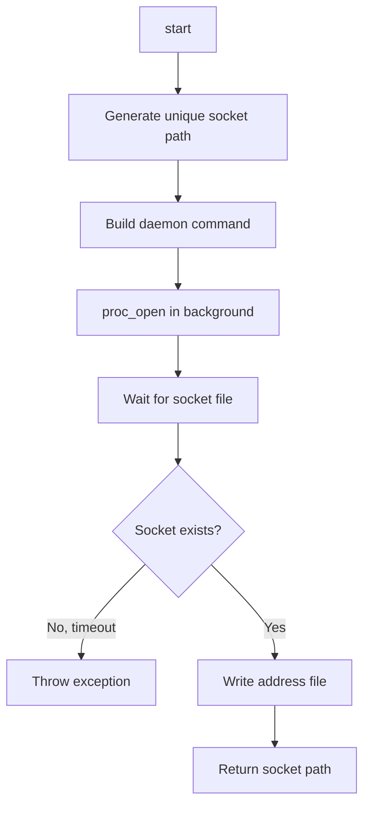

# DaemonManager

`Entreya\CsvQuery\Bridge\DaemonManager`

The `DaemonManager` handles starting the Go daemon process and managing its lifecycle from PHP.

## Responsibilities

- Spawn daemon in background
- Wait for socket file creation
- Write socket address to discovery file
- Track PID for cleanup

## Constructor

```php
public function __construct(string $binaryPath)
```

## Methods

### start()

```php
public function start(array $options = []): string
```

Starts the daemon and returns the socket address.

**Options:**
- `indexDir` (string): Default index directory
- `csvPath` (string): Default CSV file
- `port` (int): TCP port (0 = Unix socket)

**Returns:** Socket address (e.g., `/tmp/csvquery_12345.sock`)

### Startup Flow



```php
public function start(array $options = []): string
{
    $socketPath = sys_get_temp_dir() . '/csvquery_' . getmypid() . '.sock';
    
    $command = [
        $this->binaryPath,
        'daemon',
        '--socket', $socketPath,
    ];
    
    if (!empty($options['indexDir'])) {
        $command[] = '--index-dir';
        $command[] = $options['indexDir'];
    }
    
    // Start in background
    $this->startBackground($command);
    
    // Wait for socket
    $this->waitForSocket($socketPath);
    
    // Write discovery file
    file_put_contents(
        sys_get_temp_dir() . '/csvquery_daemon.addr',
        $socketPath
    );
    
    return $socketPath;
}
```

### stop()

```php
public function stop(): void
```

Terminates the daemon process if running.

## Socket Discovery

The address file allows other PHP processes to find the daemon:

```
/tmp/csvquery_daemon.addr → contains "/tmp/csvquery_12345.sock"
```

## Error Handling

| Error | Cause | Resolution |
|-------|-------|------------|
| Binary not found | Invalid binaryPath | Check path |
| Startup timeout | Daemon failed to start | Check stderr |
| Permission denied | Socket permissions | Use temp directory |

## Related Documentation

- [SocketClient](./socketclient) - Uses DaemonManager to auto-start daemon
- [Daemon (Go)](../go/daemon) - The daemon process being managed
