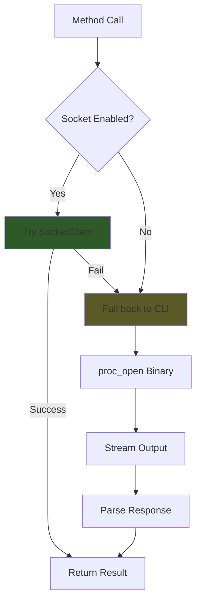
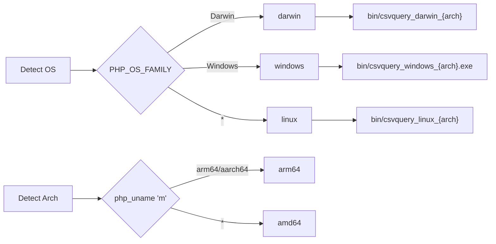

# GoBridge

`Entreya\CsvQuery\Bridge\GoBridge`

The `GoBridge` class handles communication between PHP and the Go binary. It uses a **socket-first strategy** for maximum performance, falling back to CLI execution when needed.

## Execution Strategy



## Constructor

```php
public function __construct(array $options = [])
```

**Options:**

| Key | Type | Default | Description |
|-----|------|---------|-------------|
| `workers` | int | 0 | Worker count (0 = auto) |
| `memoryMB` | int | 500 | Memory limit per worker |
| `binaryPath` | string | auto | Override binary path |
| `useSocket` | bool | true | Use socket if available |
| `indexDir` | string | '' | Index directory for socket |

## Binary Detection

Automatically detects the correct binary for the OS/architecture:



```php
private function detectBinary(): string
{
    $binDir = dirname(__DIR__, 3) . '/bin';
    
    $os = match (PHP_OS_FAMILY) {
        'Darwin' => 'darwin',
        'Windows' => 'windows',
        default => 'linux',
    };
    
    $arch = match (php_uname('m')) {
        'arm64', 'aarch64' => 'arm64',
        default => 'amd64',
    };
    
    return "{$binDir}/csvquery_{$os}_{$arch}" . ($os === 'windows' ? '.exe' : '');
}
```

## Methods

### createIndex()

```php
public function createIndex(
    string $csvPath,
    string $outputDir,
    string $columnsJson,
    string $separator = ',',
    bool $verbose = false,
    array $options = []
): bool
```

Creates indexes for CSV columns.

### query()

```php
public function query(
    string $csvPath,
    string $indexDir,
    array $where,
    int $limit = 0,
    int $offset = 0,
    bool $explain = false,
    ?string $groupBy = null,
    ?string $aggCol = null,
    ?string $aggFunc = null
): \Generator|array
```

**Returns:**
- `Generator` for standard queries (yields `['offset' => int, 'line' => int]`)
- `array` for aggregations, groupBy, or explain

### count()

```php
public function count(string $csvPath, string $indexDir, array $where): int
```

Fast count - uses socket for sub-millisecond response.

### update()

```php
public function update(string $csvPath, string $setClause, ?string $whereJson = null, string $indexDir = ''): int
```

Updates rows matching conditions. Returns updated row count.

### alter()

```php
public function alter(
    string $csvPath,
    string $columnName,
    string $defaultValue,
    string $separator = ',',
    bool $materialize = false
): void
```

Adds a virtual column to the CSV schema.

### write()

```php
public function write(string $csvPath, array $rows, array $headers = [], string $separator = ','): void
```

Appends rows to a CSV file.

### getVersion()

```php
public function getVersion(): string
```

Returns the Go binary version string.

## Process Execution

Uses `proc_open` with non-blocking I/O:

```php
private function execute(array $args, bool $passthrough = false): bool
{
    $command = array_merge([$this->binaryPath], $args);
    
    $descriptors = [
        0 => ['pipe', 'r'],  // stdin
        1 => ['pipe', 'w'],  // stdout
        2 => ['pipe', 'w'],  // stderr
    ];
    
    $process = proc_open($command, $descriptors, $pipes);
    
    // Platform-specific I/O handling
    if (PHP_OS_FAMILY === 'Windows') {
        // Polling loop (stream_select not supported)
    } else {
        // stream_select for efficiency
    }
}
```

## Debug Mode

Enable command logging:

```php
$bridge = new GoBridge();
$bridge->debug = true;  // Prints executed commands

$bridge->query(...);
// [DEBUG] Executing: /path/bin/csvquery_darwin_amd64 query --csv ...
```

Access stderr for profiling:

```php
$result = $bridge->query(...);
echo $bridge->getLastStderr();  // Timing info, debug messages
```

## Related Documentation

- [SocketClient](./socketclient) - Underlying socket connection
- [Daemon (Go)](../go/daemon) - Server that receives socket requests
- [CsvQuery](./csvquery) - High-level API using GoBridge
