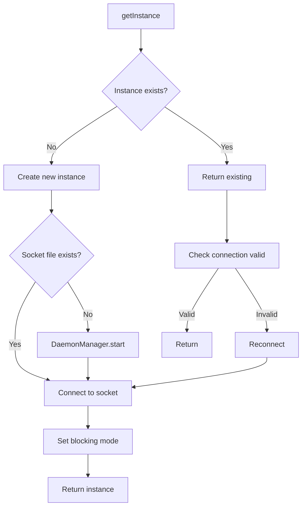

# SocketClient

`Entreya\CsvQuery\Bridge\SocketClient`

The `SocketClient` provides a **persistent connection** to the Go daemon via Unix Domain Sockets. It eliminates the ~50ms overhead of spawning a new process per query.

## Connection Lifecycle



## Singleton Pattern

Single connection per PHP process:

```php
private static ?SocketClient $instance = null;

public static function getInstance(string $binaryPath = '', string $indexDir = ''): self
{
    if (self::$instance === null) {
        if ($binaryPath === '') {
            throw new \RuntimeException('SocketClient requires binaryPath on first call');
        }
        self::$instance = new self($binaryPath, $indexDir);
    }
    return self::$instance;
}
```

## Socket Path Resolution

Priority order:

1. **Environment variable**: `CSVQUERY_SOCKET`
2. **Address file**: `/tmp/csvquery_daemon.addr`
3. **Default**: `/tmp/csvquery.sock`

```php
if ($socketPath) {
    $this->socketPath = $socketPath;
} else {
    $env = getenv('CSVQUERY_SOCKET');
    if ($env) {
        $this->socketPath = $env;
    } else {
        $addrFile = sys_get_temp_dir() . '/csvquery_daemon.addr';
        if (file_exists($addrFile)) {
            $this->socketPath = trim(file_get_contents($addrFile));
        } else {
            $this->socketPath = '/tmp/csvquery.sock';
        }
    }
}
```

## Methods

### getInstance()

```php
public static function getInstance(string $binaryPath = '', string $indexDir = ''): self
```

Returns the singleton instance. Creates if not exists.

### configure()

```php
public static function configure(string $binaryPath, string $indexDir = '', string $socketPath = ''): void
```

Pre-configures the singleton (called by GoBridge).

### query()

```php
public function query(string $action, array $params = []): array
```

Low-level query method. Sends JSON request, returns parsed response.

### count()

```php
public function count(string $csvPath, array $where = []): int
```

Fast count query.

### select()

```php
public function select(string $csvPath, array $where = [], int $limit = 0, int $offset = 0): array
```

Returns array of `['offset' => int, 'line' => int]`.

### groupBy()

```php
public function groupBy(string $csvPath, string $column, string $aggFunc = 'count', array $where = []): array
```

Grouped aggregation.

### ping()

```php
public function ping(): bool
```

Health check. Returns `true` if daemon responds.

### status()

```php
public function status(): array
```

Returns daemon status information.

## Auto-Start Daemon

If socket doesn't exist, starts daemon automatically:

```php
private function startDaemon(): void
{
    $this->daemonManager = new DaemonManager($this->binaryPath);
    $socketUrl = $this->daemonManager->start([
        'indexDir' => $this->indexDir
    ]);
    $this->socketPath = $socketUrl;
}
```

## Reconnection Logic

Handles broken connections gracefully:

```php
private function reconnect(): void
{
    if ($this->socket !== null) {
        @fclose($this->socket);
        $this->socket = null;
    }
    
    usleep(100000);  // 100ms wait
    
    if (!$this->socketFileExists($this->socketPath)) {
        $this->startDaemon();  // Restart if daemon died
    }
    
    $this->connect();
}
```

## Timeouts

| Timeout | Value | Purpose |
|---------|-------|---------|
| Connect | 5s | Initial connection |
| Query | 30s | Request/response |
| Idle | N/A | Connection persists |

## Debug Mode

```php
$client = SocketClient::getInstance($binary, $indexDir);
$client->debug = true;

// [SocketClient] Request: {"action":"count","csv":"/data.csv","where":{}}
// [SocketClient] Response: {"count":1500000,"error":null}
```

## Static Methods

### isAvailable()

```php
public static function isAvailable(): bool
```

Check if daemon socket exists (without connecting).

### reset()

```php
public static function reset(): void
```

Close connection and clear singleton (for testing).

## Related Documentation

- [GoBridge](./gobridge) - Uses SocketClient for socket-first queries
- [Daemon (Go)](../go/daemon) - Server that handles socket requests
- [DaemonManager](./daemon-manager) - Starts and manages daemon process
