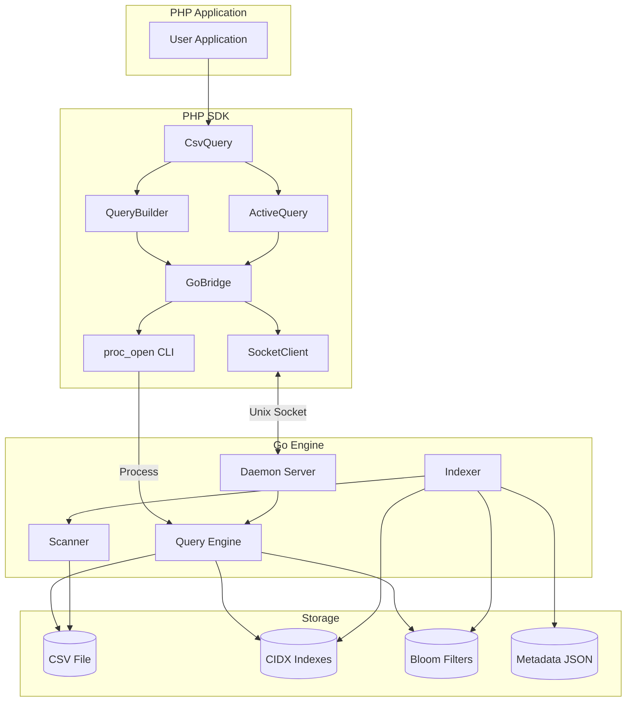

# Architecture Overview

CsvQuery is a **multi-language system** combining a high-performance Go engine with a PHP SDK for seamless integration.

## System Components



## Communication Paths

| Path | Protocol | Latency | Use Case |
|------|----------|---------|----------|
| Socket | Unix Domain Socket | ~1ms | Frequent queries |
| CLI | Process spawn | ~50ms | Indexing, one-off |
| TCP | TCP Socket | ~5ms | Cross-machine |

## File Organization

```
project/
├── data.csv                    # Source data
├── indexes/                    # Index directory
│   ├── data_email.cidx        # Compressed index
│   ├── data_email.cidx.bloom  # Bloom filter
│   ├── data_meta.json         # Metadata
│   ├── data_schema.json       # Virtual columns
│   └── data_updates.json      # Pending updates
```

## Component Responsibilities

| Component | Language | Purpose |
|-----------|----------|---------|
| CsvQuery | PHP | High-level API |
| QueryBuilder | PHP | Fluent query construction |
| GoBridge | PHP | Binary execution |
| SocketClient | PHP | Daemon communication |
| Scanner | Go | SIMD CSV parsing |
| Indexer | Go | Parallel index building |
| Query Engine | Go | Index lookup + filtering |
| Daemon | Go | Persistent server |

## Related Documentation

- [Data Flow](./data-flow) - Detailed data transformation paths
- [CIDX Format](../api-reference/go/cidx-format) - Index file format
- [Daemon](../api-reference/go/daemon) - Socket server
