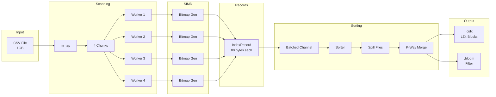
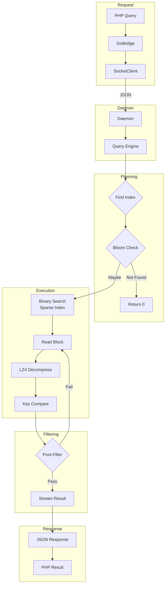
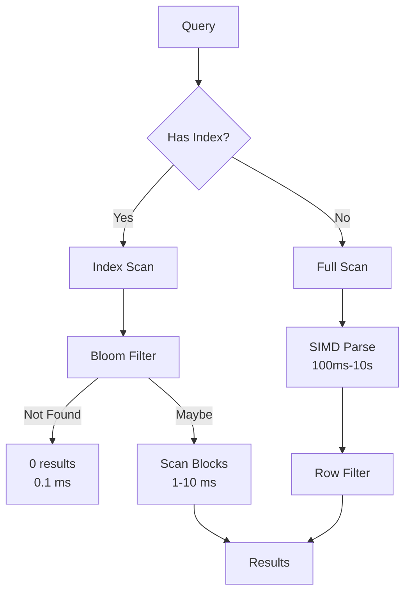
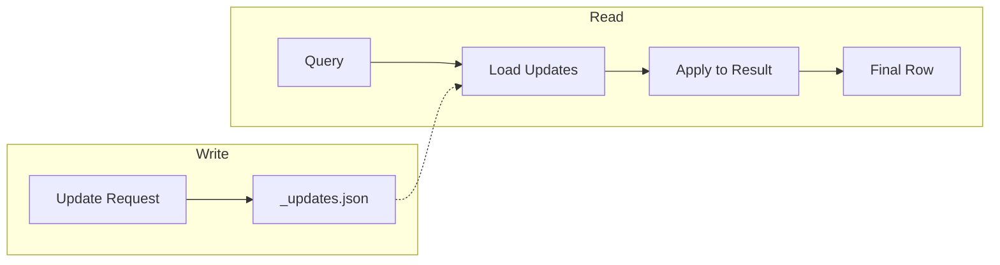

# Data Flow

Understanding how data moves through CsvQuery helps optimize performance and debug issues.

## Indexing Data Flow

### Stage Details

| Stage | Throughput | Memory | Description |
|-------|------------|--------|-------------|
| mmap | N/A | ~0 | Zero-copy file access |
| SIMD Parse | ~10 GB/s | O(1) | Bitmap generation |
| Batching | N/A | 1000 × 80B | Channel overhead reduction |
| Sort/Spill | ~500 MB/s | Configurable | External sort |
| LZ4 Compress | ~1 GB/s | 64 KB buffer | Block compression |
| Bloom Insert | O(n) | ~10 bits/key | Filter construction |

## Query Data Flow

### Query Path Timing

| Step | Typical Time | Notes |
|------|--------------|-------|
| Socket send | 0.1 ms | JSON request |
| Bloom check | 0.01 ms | Memory-mapped |
| Binary search | 0.1 ms | Log(N) blocks |
| Block decompress | 1-5 ms | LZ4 is fast |
| Key compare | O(matches) | Per-record |
| Result stream | 0.1 ms | JSON response |

## Index vs Full Scan

## Update Data Flow

Updates are stored in a sidecar file and applied at read time:

## Related Documentation

- [Architecture Overview](./architecture-overview) - System components
- [SIMD](../api-reference/go/simd) - Bitmap generation
- [CIDX Format](../api-reference/go/cidx-format) - Index structure
